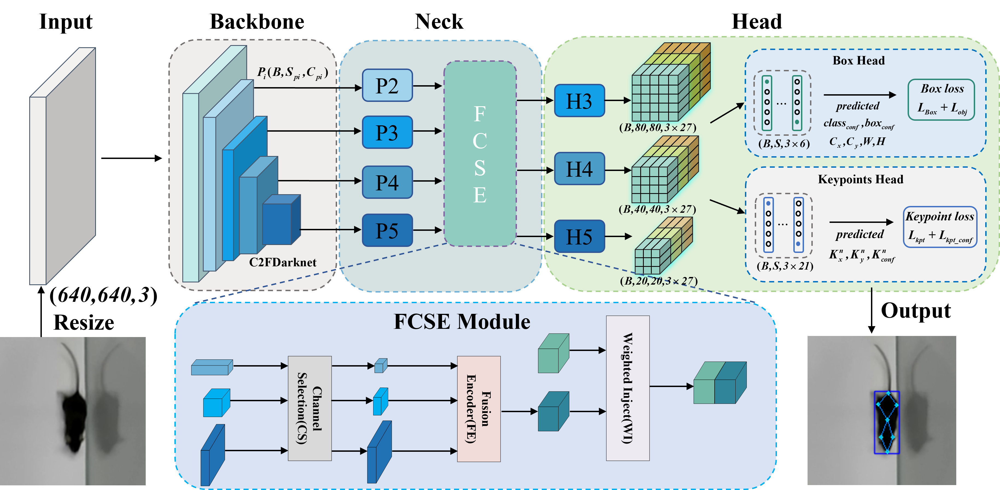
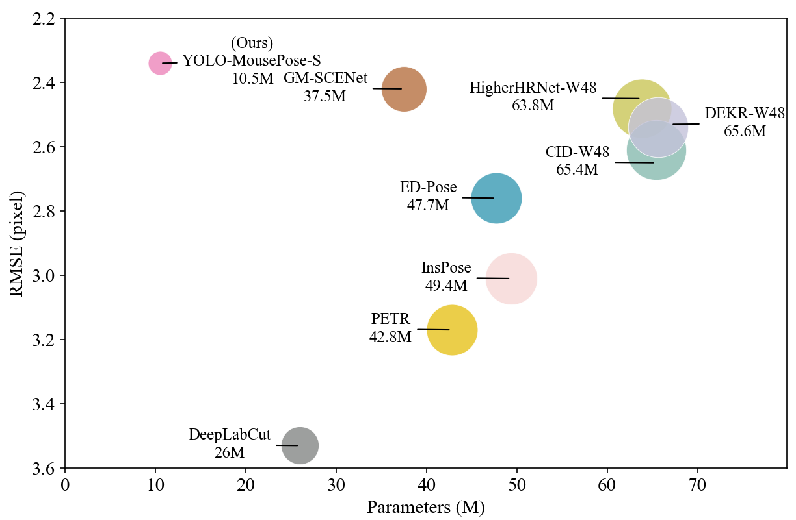

# YOLO-MousePose: Mouse Pose estimation model
This repository is the official implementation of the paper["**YOLO-MousePose: Improved YOLO-Pose forMouse Pose Estimation from a Top-down View**"].


<p align="center">

</p>


## Demo

<p align="center">
           
</p>

## Result

<p align="center">
           
</p>

## Requirements

* PyTorch>=1.7.0
* torchvision>=0.8.1
* numpy>=1.18.5
* opencv-python>=4.1.2
* PyYAML>=5.3.1
* matplotlib>=3.2.2
* tqdm>=4.41.0
* pycocotools>=2.0

## Data Preparation
The dataset needs to be prepared in YOLO format so that the dataloader can be enhanced to read the keypoints along with the bounding box informations. labelme2yolo_keypoints.py in this repository can convert the labelme annotated json file into a dataset in the required format.And our self-built dataset will be open sourced after the paper is reviewed.

Expected directoys structure:

```
YOLO-MousePose
│   README.md
│   ...   
│
data
│  dataset
│     images
│     └─────labeled-data
│           └───
│           └───
|           └───
|            '
|            .
|     labels
│     └─────labeled-data
│           └───
│           └───
|           └───
|            '
|            .
|      labelme2yolo_keypoints.py
|      train.txt
|      val.txt

```
## **Training: YOLO-MousePose**
Train a suitable model  by running the following command using a suitable pretrained ckpt from the previous section.

```
python train.py --data mouse_kpts.yaml --cfg YOLO-MousePose-T.yaml --weights 'path to the pre-trained ckpts' --batch-size 16 --img 640 --kpt-label --cache-images
                                       --cfg YOLO-MousePose-S.yaml 
                                       --cfg YOLO-MousePose-M.yaml
                                       --cfg YOLO-MousePose-L.yaml 
```


