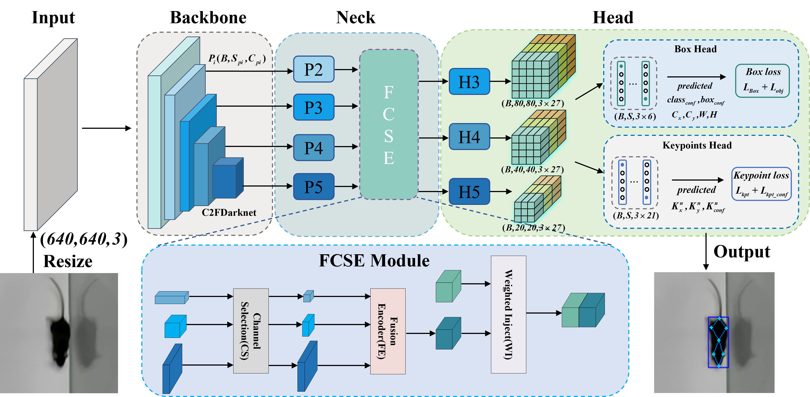

# YOLO-MousePose: Mouse Pose estimation model

## Introduction
[English](/README.md) | 简体中文

这个库是 "**YOLO-MousePose: Improved YOLO-Pose forMouse Pose Estimation from a Top-down View**"这篇论文的官方实现.YOLO-MousePose 是一款基于 PyTorch 的开源深度学习模型，专用于小鼠姿态估计。它是将[YOLO-Pose](https://github.com/TexasInstruments/edgeai-yolov5/tree/yolo-pose)移植到小鼠姿态估计领域的成功范例。通过将 neck 部分替换为我们设计的 FCSE（Fusion Channel Specialized Encoder）模块，并优化损失函数，YOLO-MousePose 有效克服了移植过程中常见的训练收敛速度慢和最终精度低的问题。此外，我们还构建了一个包含14586张带有标注的单只小鼠图片的数据集，这个数据集将在论文审稿完毕后于该库开源。
<p align="center">

</p>


## Demo

<p align="center">
           
</p>
<p align="center">
             
</p>
<p align="center">
           
</p>

## Result
YOLO-MousePose即使面对小鼠直立(a)、低头(b)和蜷缩(d)等复杂姿态以及身体部位被遮挡的情况(c)，仍能准确识别出关键点的物理属性，并精确定位实验鼠的关键点位置。
<p align="center">
  
</p>
与其他最先进的方法相比，我们提出的YOLO-MousePose实现了效率和准确性的统一。
<p align="center">

</p>

## Requirements

* PyTorch>=1.7.0
* torchvision>=0.8.1
* numpy>=1.18.5
* opencv-python>=4.1.2
* PyYAML>=5.3.1
* matplotlib>=3.2.2
* tqdm>=4.41.0
* pycocotools>=2.0

## Data Preparation
数据集需要按照 YOLO 格式进行准备，以便可以正常运行数据加载器，使其能够同时读取关键点和边界框信息。该仓库提供了[labelme2yolo_keypoints.py](data/dataset/labelme2yolo_keypoints.py) 脚本可以将 labelme 标注的 JSON 文件转换为所需格式的数据集。

预期的目录结构为：

```
YOLO-MousePose
│   README.md
│   ...   
│
data
│  dataset
│     images
│     └─────labeled-data
│           └───
│           └───
|           └───
|            '
|            .
|     labels
│     └─────labeled-data
│           └───
│           └───
|           └───
|            '
|            .
|      labelme2yolo_keypoints.py
|      train.txt
|      val.txt

```
## **Training: YOLO-MousePose**
通过运行以下命令并使用预训练模型，训练一个合适的模型。
```
python train.py --data mouse_kpts.yaml --cfg YOLO-MousePose-T.yaml --weights 'path to the pre-trained ckpts' --adamW --batch-size 16 --img 640 --kpt-label --cache-images
                                       --cfg YOLO-MousePose-S.yaml 
                                       --cfg YOLO-MousePose-M.yaml
                                       --cfg YOLO-MousePose-L.yaml 
```


